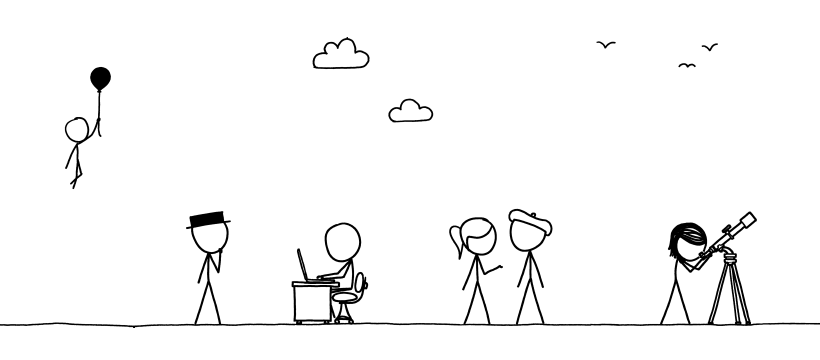
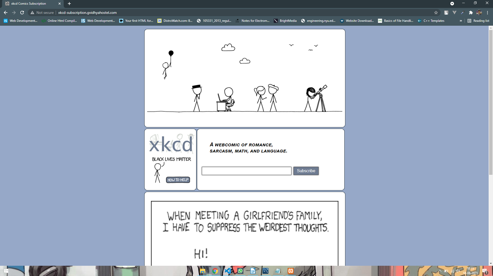
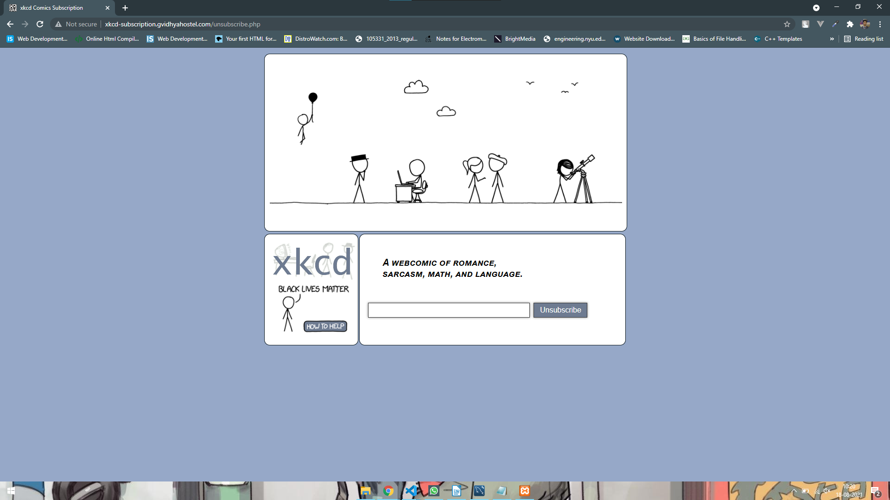

<!-- PROJECT HEADER -->
 

  

  <h3 align='center'>XKCD comic subscription</h3>

  

    Subscription service for XKCD digital comics
     
    <a href='https://github.com/rtlearn/php-madhav7360'><strong>Explore the docs »</strong></a>
     
     
    <a href='http://xkcd-subscription.gvidhyahostel.com/'>View Demo</a>
    ·
    <a href='https://github.com/rtlearn/php-madhav7360/issues'>Report Bug</a>
    ·
    <a href='https://github.com/rtlearn/php-madhav7360/issues'>Request Feature</a>
  

<!-- TABLE OF CONTENTS -->

 
  
  

  
<h2 style='display: inline-block'>Table of Contents</h2>

  <ol>
    <li><a href='#about-the-project'>About The Project</a></li>
    <li><a href='#built-with'>Built With</a></li>  
    <li><a href='#contact'>Contact</a></li>    
  </ol>

 

<!-- ABOUT THE PROJECT -->
## About The Project

This project is a PHP based assignment from rtCamp. It is a comic subscription service that sends a random XKCD comic https://xkcd.com to registered emails of all the subscribers every 5 minutes.
 

To subscribe you have to visit the <a href='http://xkcd-subscription.gvidhyahostel.com/'>Site</a> and enter your email address. To verify the email address, a randomly generated 6 digit OTP is then sent on user's email Id that has to be entered in the prompted verification form. Once the email Id is verified, database is checked to make sure that this email address is not alreadyy present in active subscription list, if it is not the user is added to subscription list and will start getting mails at 5 minute interval.
   
    

To unsubscribe from the service an unsubscription link is shared in every mail, which allows users to verify their email id and then unsubscribe from the service.
   
  

## Built With

* [HTML 5](https://developer.mozilla.org/en-US/docs/Web/HTML)
* [CSS 3](https://developer.mozilla.org/en-US/docs/Web/CSS)
* [PHP](https://www.php.net/)
* [cURL](https://www.php.net/manual/en/ref.curl.php)
* [SENDGRID](https://sendgrid.com/) 

<!-- CONTACT -->
## Contact

[@madhavmanocha](https://www.linkedin.com/in/madhavmanocha/) - madhavmanocha7@gmail.com

Project Link: [https://github.com/rtlearn/php-madhav7360](https://github.com/rtlearn/php-madhav7360)

